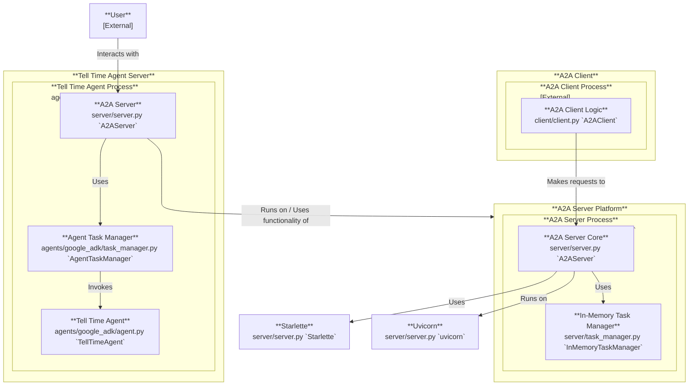

# Unnamed CodeViz Diagram

```mermaid
graph TD

    base.cv::user["**User**<br>[External]"]
    base.cv::starlette["**Starlette**<br>server/server.py `Starlette`"]
    base.cv::uvicorn["**Uvicorn**<br>server/server.py `uvicorn`"]
    subgraph base.cv::tellTimeAgentServer["**Tell Time Agent Server**<br>[External]"]
        subgraph base.cv::tellTimeAgentServer_process["**Tell Time Agent Process**<br>agents/google_adk/__main__.py `main`"]
            base.cv::tellTimeAgentServer_a2aServer["**A2A Server**<br>server/server.py `A2AServer`"]
            base.cv::tellTimeAgentServer_tellTimeAgent["**Tell Time Agent**<br>agents/google_adk/agent.py `TellTimeAgent`"]
            base.cv::tellTimeAgentServer_taskManager["**Agent Task Manager**<br>agents/google_adk/task_manager.py `AgentTaskManager`"]
            %% Edges at this level (grouped by source)
            base.cv::tellTimeAgentServer_a2aServer["**A2A Server**<br>server/server.py `A2AServer`"] -->|"Uses"| base.cv::tellTimeAgentServer_taskManager["**Agent Task Manager**<br>agents/google_adk/task_manager.py `AgentTaskManager`"]
            base.cv::tellTimeAgentServer_taskManager["**Agent Task Manager**<br>agents/google_adk/task_manager.py `AgentTaskManager`"] -->|"Invokes"| base.cv::tellTimeAgentServer_tellTimeAgent["**Tell Time Agent**<br>agents/google_adk/agent.py `TellTimeAgent`"]
        end
    end
    subgraph base.cv::a2aServerPlatform["**A2A Server Platform**<br>[External]"]
        subgraph base.cv::a2aServerPlatform_process["**A2A Server Process**<br>server/server.py `uvicorn.run`"]
            base.cv::a2aServerPlatform_a2aServerCore["**A2A Server Core**<br>server/server.py `A2AServer`"]
            base.cv::a2aServerPlatform_inMemoryTaskManager["**In-Memory Task Manager**<br>server/task_manager.py `InMemoryTaskManager`"]
            %% Edges at this level (grouped by source)
            base.cv::a2aServerPlatform_a2aServerCore["**A2A Server Core**<br>server/server.py `A2AServer`"] -->|"Uses"| base.cv::a2aServerPlatform_inMemoryTaskManager["**In-Memory Task Manager**<br>server/task_manager.py `InMemoryTaskManager`"]
        end
    end
    subgraph base.cv::a2aClient["**A2A Client**<br>[External]"]
        subgraph base.cv::a2aClient_process["**A2A Client Process**<br>[External]"]
            base.cv::a2aClient_logic["**A2A Client Logic**<br>client/client.py `A2AClient`"]
        end
    end
    %% Edges at this level (grouped by source)
    base.cv::a2aClient_logic["**A2A Client Logic**<br>client/client.py `A2AClient`"] -->|"Makes requests to"| base.cv::a2aServerPlatform_a2aServerCore["**A2A Server Core**<br>server/server.py `A2AServer`"]
    base.cv::user["**User**<br>[External]"] -->|"Interacts with"| base.cv::tellTimeAgentServer_a2aServer["**A2A Server**<br>server/server.py `A2AServer`"]
    base.cv::tellTimeAgentServer_a2aServer["**A2A Server**<br>server/server.py `A2AServer`"] -->|"Runs on / Uses functionality of"| base.cv::a2aServerPlatform["**A2A Server Platform**<br>[External]"]
    base.cv::a2aServerPlatform_a2aServerCore["**A2A Server Core**<br>server/server.py `A2AServer`"] -->|"Runs on"| base.cv::uvicorn["**Uvicorn**<br>server/server.py `uvicorn`"]
    base.cv::a2aServerPlatform_a2aServerCore["**A2A Server Core**<br>server/server.py `A2AServer`"] -->|"Uses"| base.cv::starlette["**Starlette**<br>server/server.py `Starlette`"]

```
---
*Generated by [CodeViz.ai](https://codeviz.ai) on 6/3/2026, 2:18:03 PM*
